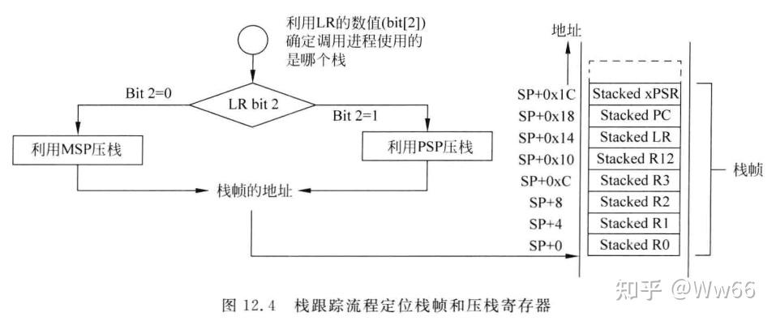

[TOC]

# HardFault 分析教程
Teach you how to locate HardFault and analyze its causes（教你如何定位HardFault，并分析HardFault的原因）

## 1. 定位HardFault产生的位置
>**操作方法**:把你的void HardFault_Handler(void) 替换成下摆你这段代码，然后在hardfault处打断点，单步执行就可以找到问题原因处

### 1.1 先修基础知识
>[参考文档-HardFault定位方法](https://link.zhihu.com/?target=https%3A//blog.csdn.net/m0_57249200/article/details/145891788%3Ffromshare%3Dblogdetail%26sharetype%3Dblogdetail%26sharerId%3D145891788%26sharerefer%3DPC%26sharesource%3Dm0_57249200%26sharefrom%3Dfrom_link)

>
>

>**总结**:根据单片机进中断，寄存器压栈情况，压栈时候把LR寄存器值（存储着返回来要执行的程序地址）也压进去了，那只需要在hardfault ISR里边把LR值取出来赋值给PC就可以定位到引发hardfault的地方，如下面操作，不过这个只是定位到了引发hardfault的位置，下一步还需要结合hradfault状态寄存器分析产生的具体原因

### 1.2 C语言版本
>注意！！ 下边的MSP值+0X1C为存 LR的值，这个不同核心单片机有区别，M3核的理论上来说加0X14就可以了，但是M0核得+0x1C，实践得出来的结果

```c
// Return the R13(Stack Pointer)
__ASM unsigned int __Get_SP_Value(void)
{
    mov r0, r13 //R13(SP)
    bx lr
}

void (*f1)(void);
unsigned int result;

void HardFault_Handler(void)
{
    //实际操作Arm Coretex-M0核心的是+0x1C，M3核的是+0X14
    result = __Get_SP_Value()+0x14;
    f1 = *( (unsigned int*)result );
    f1();
    while (1);
}
```
>

### 1.3 汇编语言版本
>注意！！ 下边的MSP值+0X1C为存 LR的值，这个不同核心单片机有区别，M3核的理论上来说加0X14就可以了，但是M0核得+0x1C，实践得出来的结果

```armasm
；把你的起始.s文件内的HardFault_Handler代码换成下边这个

HardFault_Handler\
                PROC
                add   r0, sp, #0x14     
                ldr   r1, [r0]          
                blx   r1                
                B       .
                ENDP
```
>

### 1.4 操作方法
>当产生了hardfault后，选择上述1.2或者1.3的代码方案后，debug 在hardfult处打断点执行到hardfault ISR处之后再单步执行，就可以找到出问题的地方了

---
## 2. 分析HardFault原因

>分析产生HardFault的原因（需要具体代码具体分析仔细崩溃处的代码的问题）
hardfault产生的原因有很多，例如访问非法地址了，函数指针变量为NULL，然后直接运行了，总共包含以下几种

1. 内存访问错误

- 访问了未映射的内存区域。

- 对只读内存区域执行写操作。

- 访问了无效的内存地址（如NULL指针解引用）。

2. 堆栈溢出：

- 如果任务或中断的堆栈空间不足，可能导致堆栈溢出，进而破坏内存或触发HardFault。

3. 未对齐的内存访问：

- 某些STM32系列要求特定的数据类型在内存中对齐。未对齐的访问可能触发HardFault。

4. 错误的异常处理：

- 如果在异常处理程序中再次发生异常，且没有正确处理，可能会导致HardFault。

5. 中断优先级配置错误：

- 如果配置了错误的中断优先级，可能导致不可屏蔽中断（NMI）或HardFault。

6. 非法指令或状态：

- 执行了未定义的指令。

- 尝试切换到无效的处理器模式。

7. 外设配置错误：

- 错误地配置或使用了外设，如未启用时钟就访问外设寄存器。

8. 电源问题：

- 不稳定的电源可能导致处理器行为异常，从而触发HardFault。

9. 软件错误：

- 逻辑错误、数组越界、类型转换错误等编程错误也可能导致HardFault。

>但是这些太笼统了，太废话了，具体是哪个呢？？ 那还得看HardFault状态寄存器（HFSR）以及其他相关的故障状态寄存器，如配置管理故障状态寄存器（CFSR）、内存管理故障状态寄存器（MMFSR）、总线故障状态寄存器（BFSR）和使用故障状态寄存器（UFSR）。
下图是HardFault状态寄存器，引发hardfault了可以看看这个寄存器值，然后再仔细检查下代码
---
### 2.1 Chinese version
>
>

### 2.1 English version
>
>
>